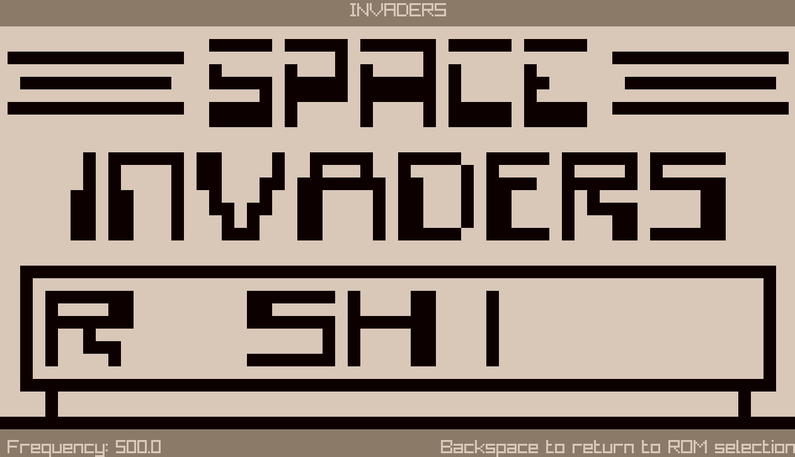
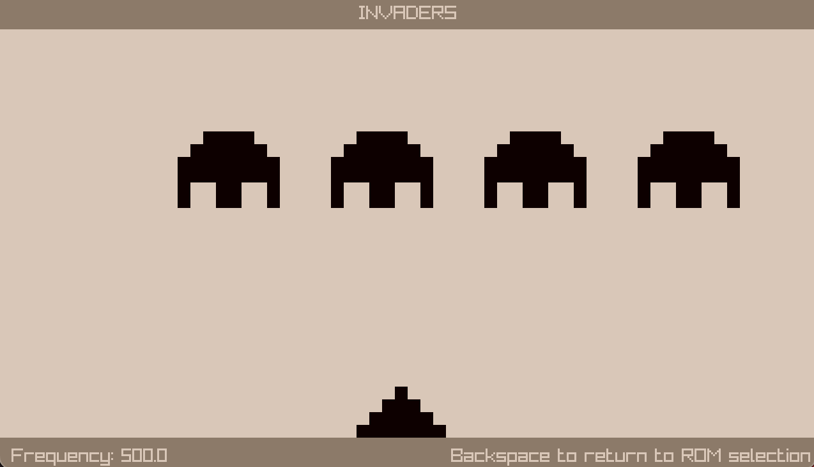
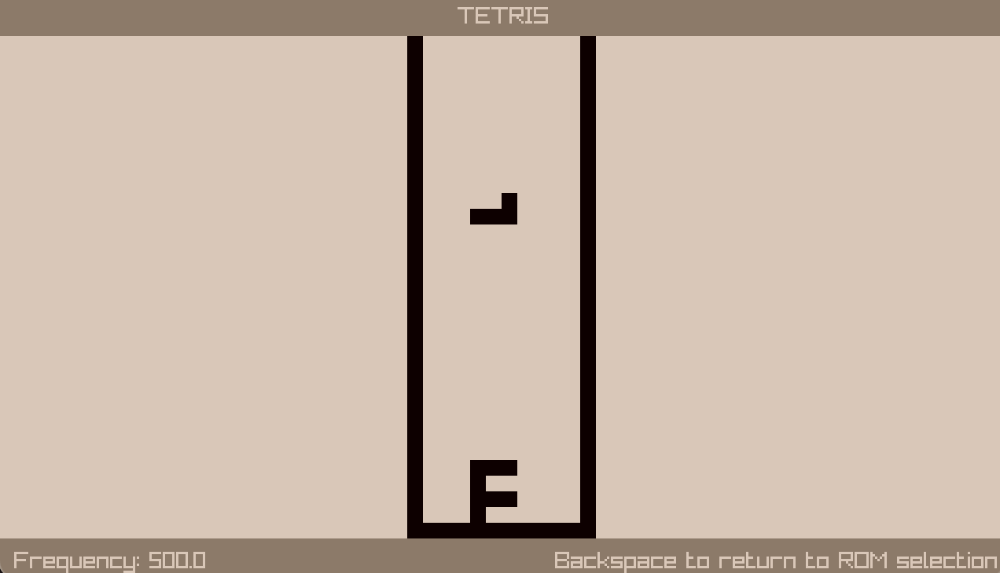
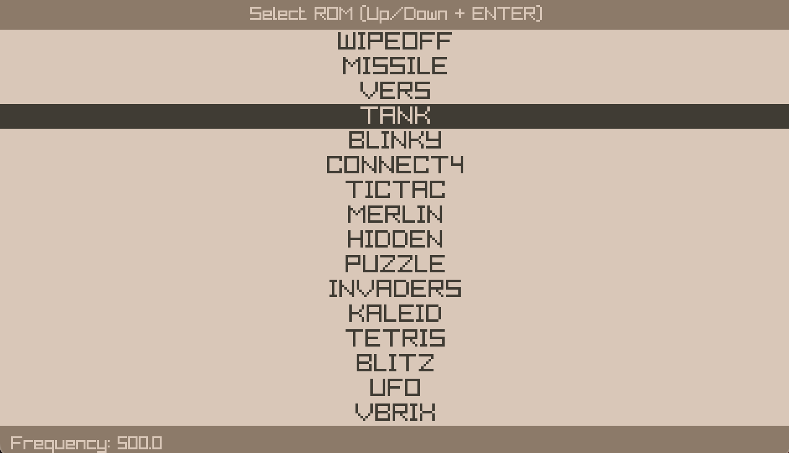

# Chip-8 emulator

A Chip-8 emulator written in C with raylib.

[Test it here](https://nath-biag.com/projects/emulator.html)






## Controls

Chip-8 uses a 16 keys keyboard mapped as such:

```
1 2 3 4

A Z E R

Q S D F

W X C V
```

Actual controls depend on the ROM itself.

## Building

```
cmake -DRAYLIB_LIBRARY_PATH=<PATH TO RAYLIB LIBRARY FILE> -DRAYLIB_INCLUDE_PATH=<PATH TO RAYLIB HEADER>
make
ctest # run unit tests
```

If you want to use the built in ROM picker, you need to provide a path to a directory containing your Chip-8 roms to the cmake command:

`-DROMS_DIR=<PATH TO ROMS DIR>`

The emulator can be compiled with emscripten to run in a web browser.

## Running

`./emulator [ROM_PATH]`

If `ROM_PATH` is provided, the emulator will run the specified ROM, otherwise it will let you pick a ROM from the provided directory (see Building section).

## Test ROMS and resources

- [C8TECH10](http://devernay.free.fr/hacks/chip8/C8TECH10.HTM)
- [chip8-test-suite](https://github.com/Timendus/chip8-test-suite)
- [chip8-test-rom](https://github.com/corax89/chip8-test-rom)
